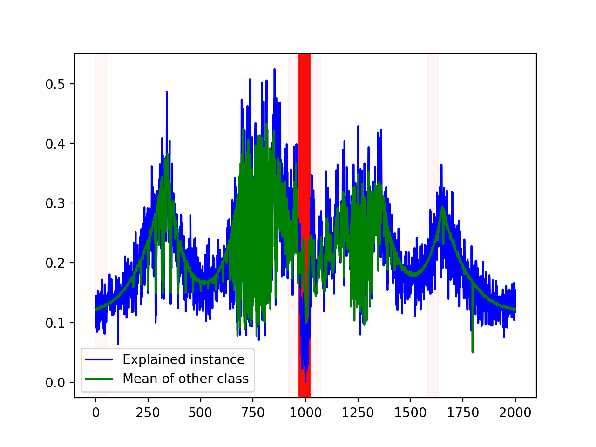
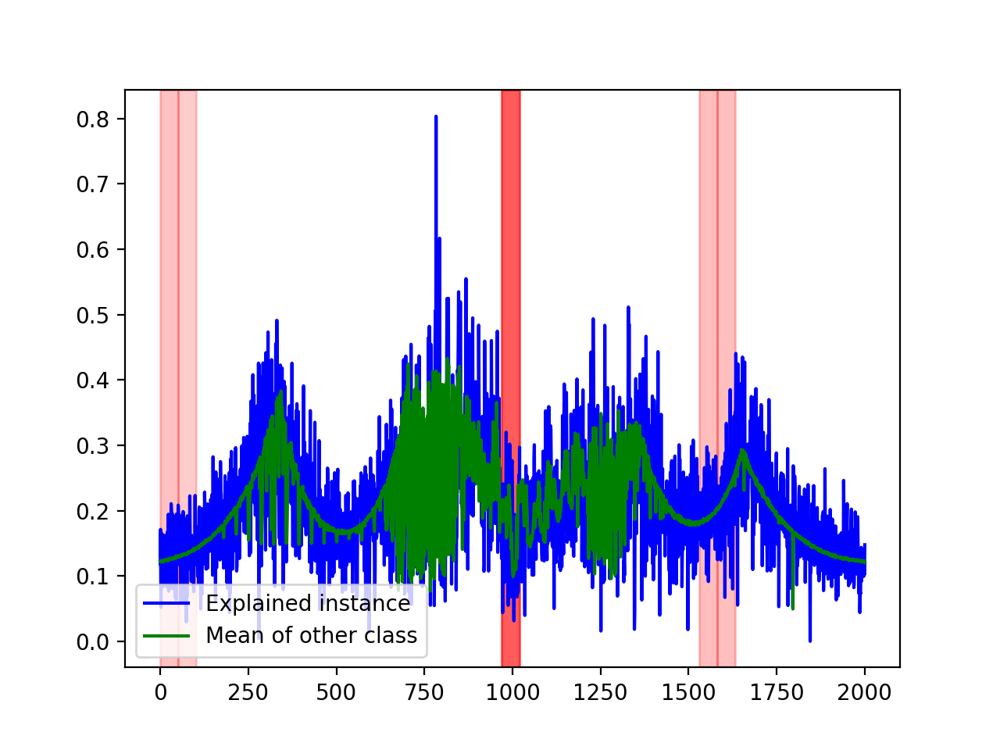

# Interpretable Machine Learning - Exoplanet Identification

This is the third part of my undergraduate final project. The main goal was to find how neural networks classify an exoplanet.

Lime itself does not support time series data, so Lime For Time was used [1]. This library was slightly modified to support neural networks built with Keras.

# References

[1] Jonas Hering, Emanuel Metzenthin & Alexander Zenner; Lime for Time ; https://github.com/emanuel-metzenthin/Lime-For-Time

[![Stars][stars-shield]][stars-url]
[![Issues][issues-shield]][issues-url]
